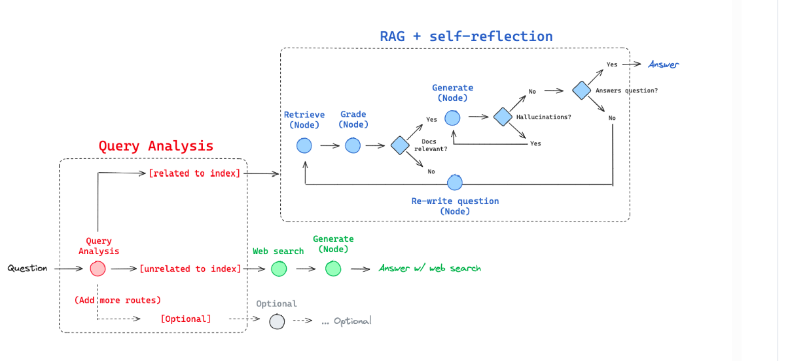
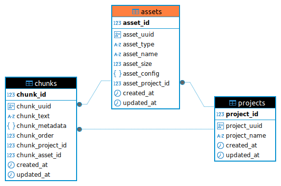

# 🧠 Multi-Source RAG Chatbot

## Overview

This project implements a **Retrieval-Augmented Generation (RAG) Chatbot** capable of answering user queries using three different retrieval strategies orchestrated with **LangGraph**:

- 💬 **Native LLM Responses** – answers generated directly from the language model  
- 🧲 **Vectorstore-Based Retrieval (RAG)** – using a local **Qdrant** database (substituted for ChromaDB due to installation issues). 
- 🌐 **Web Search-Based Augmentation** – leveraging external tools like **Tavily** for real-time answers

The chatbot dynamically determines the best strategy based on the user query, showcasing **context awareness** and an **adaptive retrieval strategy**.

---
> _Note: The code has two branches: one before the deadline and another after it. I succeeded in running the chatbot with both web search and vector database data, as well as the chatbot with direct LLM integration._

---

## 📚 Table of Contents

- [Step-by-Step Implementation](#step-by-step-implementation)
- [What the Chatbot Can Do](#what-the-chatbot-can-do)
- [Key Highlights](#key-highlights)
- [Tech Stack](#tech-stack)
- [Results](#results)
- [Evaluation with LangSmith](#evaluation-with-langsmith)
- [Architecture Diagram](#architecture-diagram)
- [Screenshots & Logs](#screenshots--logs)
- [Requirements & Installation & Run the FastAPI server](#requirements-installation-run-the-fastapi-server)


---

## 🔧 Step-by-Step Implementation

1. Loaded a **Heart Health PDF** as a knowledge base (he file name was automatically **sanitized and regenerated** to prevent naming conflicts).
2. Split the document into smaller, context-rich chunks for effective retrieval.
3. Encoded these chunks into embeddings using the configured **embedding model** (from any provider in `src/stores/llm/providers`) and stored them in the configured **vectore database** «Qdrant» (from any provider in `src/stores/vectordb/providers`) 
4. Used **language-specific prompt templates** (via `template_parser.py` in `src/stores/llm/templates/`) to generate prompts in the configured language (e.g., `en=English`), enhancing localization and clarity in responses.
5. Generate human-like answers using the configured **LLM model** (from any provider in `src/stores/llm/providers`).
6. Used **LangGraph** to analyze queries, route them to the proper data source, and handle multi-step reasoning (in `src/stores/langgraph`).

---

## 💬 What the Chatbot Can Do

### Intelligent Source Selection

The chatbot analyzes each query and selects among:

- **Retrieval Augmented Generation**
- **Web search**
- **Direct LLM generation**

### Adaptive Retrieval Logic

🖼️ Adaptive RAG Routing Overview:  


If the question relates to **indexed topics (e.g., AI)**:

1. **Retrieve**: Fetch relevant chunks  
2. **Grade**: Assess document relevance  
3. **Generate**:  
   - If grounded in retrieved facts → generate the answer  
   - If not relevant → re-retrieve documents  
   - If response unrelated → re-query the vectorstore  

If the query is **external or real-time**:  
- Use **web search** → retrieve and generate an answer.

If the query is **general/casual**:  
- Use the **LLM directly** for open-domain generation.

This system uses **self-correction and retry logic** to improve grounding and accuracy.

---

## 🚀 Key Highlights

- ✅ **PostgreSQL Integration** with migration tools  
- ✅ **Pydantic Schemas** for clean model validation  
- ✅ **Qdrant Vector Database** for scalable semantic search  
- ✅ **Factory Pattern** for modular LLM provider integration  
- ✅ **Multilingual Prompt Templates** for consistent and localized interactions in English, and more for all system prompts.
- ✅ **MVC-Based Architecture** ensuring separation of concerns and maintainability 
- ✅ **Full NLP Pipeline**: Upload → Chunk → Index → Query →  Query Analysis → Generate  
- ✅ **LangGraph Orchestration** for adaptive strategy control  
- ✅ **Support for multiple LLM, vectore database, web search  providers** 

---

## 🧠 Architecture Diagram



> _Note: The assets table  uses a generalized naming convention to support easy future integration of other data modalities such as images, audio, and various data types._

---

## ⚙️ Tech Stack

| Tool           | Purpose                                          |
|--------------  |--------------------------------------------------|
| **FastAPI**    | High-performance backend API                     |
| **PostgreSQL** | Relational data storage                          |
| **Qdrant**     | Vector database for semantic search              |
| **LangGraph**  | Adaptive RAG flow control                        |
| **LangChain**  | Parsing, chunking, and tool integration          |
| **Pydantic**   | Data validation and typing                       |
| **SQLAlchemy** | ORM for database operations                      |
| **Alembic**    | Database migrations                              |
| **Docker**     | Containerized deployment                         |

---

## Results 

- Runtime Chatbot with Internal Data
[Runtime chatbot with external data](src/assets/images/runtime/runtime_llm_internal_data.png)

- Runtime Chatbot with Web Search (after 18/04/2025)
[Runtime chatbot with web search](/home/user/Documents/Project/mini-rag-html/src/assets/images/runtime/run_time_web_search.png)

- Runtime Chatbot with Vector Database (after 18/04/2025)
[Runtime chatbot with vectore database](src/assets/images/runtime/run_time_rag.png)

## 🧪 Evaluation with LangSmith

We use to trace RAG workflows.

🔍 [View Example Trace](https://smith.langchain.com/public/2ae5ef28-7c59-47b7-b5cd-e9f70596544f/r)


## 📸 Screenshots & Logs

To provide more transparency and help with debugging or understanding system behavior, we've included **screenshots of key issues and successful runs**.

Browse `src/assets/images/` for:

- ✅ Runtime execution examples  
- 🧭 Adaptive graph routing logic  
- 🐛 Error trace screenshots  
- 🔍 Debug logs

---
## 📖 Further Reading

- [Read more: Adaptive RAG strategy using LangGraph (Official Tutorial)](https://github.com/langchain-ai/langgraph/blob/main/docs/docs/tutorials/rag/langgraph_adaptive_rag.ipynb)  
- [Qdrant – Vector Database Overview](https://qdrant.tech/qdrant-vector-database/)
- [Cohere – LLMs Provider Overview](https://cohere.com/about)
- [Fastapi – web framework for building APIs with Python](https://fastapi.tiangolo.com/)

---

## (Optional) Steup your command line intrface for better readability
```bash
export PS1="\[\033[01;32m\]\u@\h:\w\n\[\033[00m\]\$ "
```

## Requirements & Installation & Run the FastAPI server

 Python 3.10 or later

#### Install Dependencies 

```bash 
sudo apt update
sudo apt install libpq-dev gcc python3-dev
```

#### Install Python using pip3

1) install pip 

```bash 
$ sudo apt-get install python3-pip
```

2)  create a new environnement 

```bash
$ python3 -m venv .venv
```

3) Activer l’environnement virtuel 
```bash 
source .venv/bin/activate
```

## Installation


### Install the required packages

```bash 
$ pip install -r requirements.txt
```

### Setup the environment variables
```bash 
$ cp .env.example .env
```
Set your environment variables in the .env file. Like OPENAI_API_KEY value.

### Run Alembic Migration 
```bash
$ alembic upgrade head
```

### Run Docker Compose Services
```bash 
$ cd docker
$ cp .env.example .env
```
*update .env with your credentials

```bash 
$ cd docker
$ sudo docker compose up -d
```

### Run the FastAPI server

```bash
$ uvicorn main:app --reload --host 0.0.0.0 --port 7000
```
